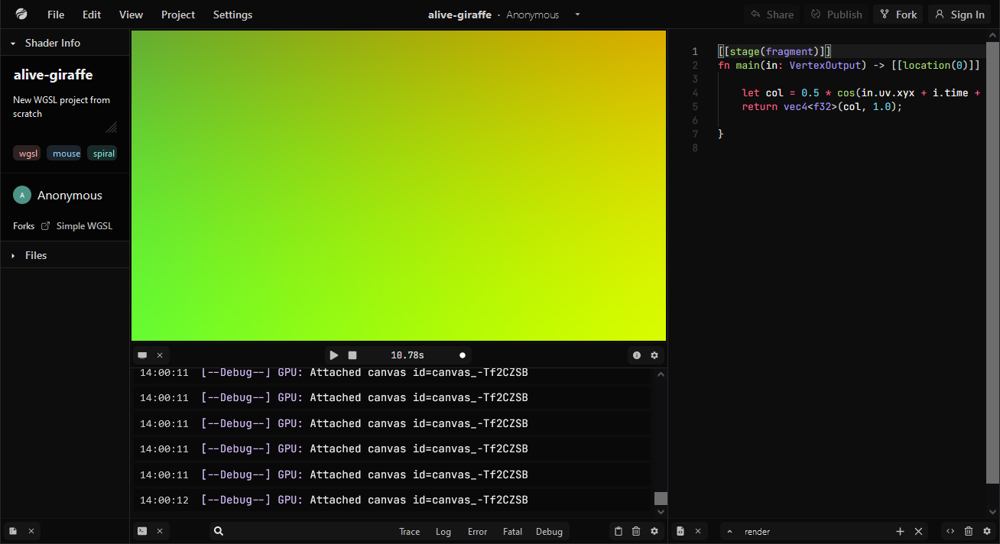

#### Note: See supported browsers 
# [gputoy](https://gputoy.io)

## A shader prototyping tool built for [`WebGPU`](https://www.w3.org/TR/webgpu/).

## **Top Goals**

- **Multi Language Support**
  - `glsl` and `wgsl` shader compilation.
  - Target `wgsl` using [`Naga`](https://github.com/gfx-rs/naga) in a small `webassembly` module. This is to provide maximum browser support as `wgsl` is the preferred language for `webgpu`. Chrome's implementation is able to take `spirv`, but I believe this will be removed.
  - User should be able to use `glsl` and `wgsl` in the same project. gputoy's `webgpu` systems should treat the compiled modules identically.

- **Sharing Projects**
  - Sharing should be easy and should come in different varieties.
    - Publishing: Makes project visible to other users. 
    - Generated link: A link that the owner can generate for other users to view a project, even if it's unpublished.
    - Embed: Generates an embedable link.

- **Barrier of Entry**
  - Starting a new project and forking a project should be dead simple.
  - Unobtrusive tutorials to learn app features.
  - Documentation for both languages provided within editor. 

- **Good Editor UX/UI**
  - Provide an intuitive and consistent experience. 
  - Maintain high component reusability to ensure consistency across many site actions. 
  - Take inspiration from elegant user interfaces like Blender and Ableton.

- **Extendability**
  - User should be able to abstract shader functions, shader uniforms, sub-passes, buffer layouts, buffer initializations, and more.
  - These abstractions can be saved to use in a future project and published for other users to use, like a marketplace.
  - For example, an extension for ray march shapes. For the end user, it would provide a set of functions they can call in their shader to calculate signed distance for common shapes.

- **Low Bandwith/Storage**
  - I dont ever plan on running ads on gputoy, so expenses should be kept to a minimum. Monetization will only be used as necessary.
  - Saving to database will be explicit.

***

## **Currently Supported Browsers**
  - Chrome version > 94 will work automatically thanks to origin trial
    - Chrome version > 80 with `enable-unsafe-webgpu` flag enabled
  - Firefox version > 63 with `dom.webgpu.enabled` flag enabled
  - Safari version > 11.1 with `WebGPU` experimental feature on MACOS (not tested)

  